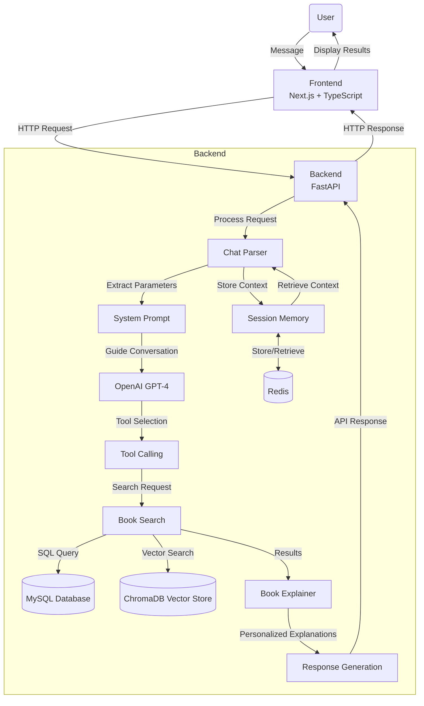

# 📚 AI Book Seeker

An AI-powered chatbot that helps users discover suitable books based on age, interests, and budget through natural conversation.


## 🎯 Problem & Solution

### Problem:

- Parents struggle to find age-appropriate books for children
- Hard to discover titles without knowing them in advance
- Difficult to match books to specific interests, reading levels, and budgets

### Solution:

- Natural language interface understands conversational requests
- Automatically extracts key parameters (age, purpose, budget) from user input
- Provides personalized recommendations with tailored explanations
- Maintains context across conversation for follow-up questions

**Example Interaction:**

```
User: "I need books for my 6-year-old who is learning to read. My budget is around $50."

AI: "I found these books that match your criteria:

- 'Bob Books, Set 1: Beginning Readers' by Bobby Lynn Maslen: Simple phonics-based stories perfect for beginning readers age 4-6 with gradually increasing complexity to build confidence.

- 'The Reading House Set 1: Letter Recognition' by Marla Conn: Colorful workbooks designed specifically for 5-6 year olds beginning their reading journey with engaging illustrations.

- 'Elephant & Piggie: There Is a Bird on Your Head!' by Mo Willems: Award-winning easy reader with simple vocabulary, expressive characters and humorous storyline that beginning readers love.

- 'Frog and Toad Are Friends' by Arnold Lobel: Classic friendship stories with short chapters and charming illustrations, ideal for children transitioning to independent reading."
```

## 📱 UI Demo

Here's a visual overview of the AI Book Seeker interface:

### Conversation Flow


### Book Recommendations


### Refinement and Follow-up Questions


### Detailed Book Information


## 🧱 Tech Stack

| Component | Technology                      |
| --------- | ------------------------------- |
| Frontend  | Next.js + TypeScript            |
| Backend   | FastAPI (Python)                |
| AI        | OpenAI GPT-4 with tool-calling  |
| Data      | MySQL + ChromaDB (vector store) |

## 🚀 Installation & Setup

```bash
# Clone repository
git clone https://github.com/yourusername/ai-book-seeker.git
cd ai-book-seeker

# Frontend
cd frontend
npm install
npm run dev

# Backend
cd ../backend
pip install -r requirements.txt
cp .env.example .env
# Edit .env with your API keys and database credentials
uvicorn main:app --reload --host 0.0.0.0 --port 8000
```

## 🤖 Key AI Features

| Feature                        | Business Value                                                                  | Implementation                                                       |
| ------------------------------ | ------------------------------------------------------------------------------- | -------------------------------------------------------------------- |
| Natural Language Understanding | Processes user requests in everyday language without requiring specific formats | System prompt with guidance for parameter extraction                 |
| Query Flexibility              | Handles unexpected or novel request types beyond training examples              | Zero-shot capability in system prompts and general query handling    |
| Consistent Output Formatting   | Ensures recommendations follow standardized, user-friendly formats              | One-shot learning with example templates in explainer.py             |
| Intelligent Function Selection | Automatically selects appropriate search functions based on user needs          | Tool calling via OpenAI function API with custom tools               |
| Semantic Search                | Finds relevant books beyond exact keyword matching, improving results           | RAG (Retrieval Augmented Generation) with ChromaDB vector embeddings |
| Conversational Memory          | Remembers previous interactions for natural, ongoing conversations              | Context-aware memory system with Redis and automatic summarization   |

## 🔄 System Flow



## 📊 Data Structure

**MySQL Schema:** Books table with title, author, description, age_range, purpose, price, etc.

**Vector Embeddings:** Title + description + tags for semantic search

## 🔜 Roadmap

### ✅ MVP (Current)

- Natural language chat
- MySQL + ChromaDB search
- Tool calling
- Long chat memory
- Human-style explanations

### 💜 Phase 2

- External APIs (Amazon, Google Books)
- Voice input (Whisper)
- User accounts and history
- Advanced personalized suggestions with Chain-of-Thought
  - Multi-factor analysis (reading history, developmental needs)
  - Step-by-step reasoning for recommendations

## 📁 Project Structure

Key files:

- `backend/chat_parser.py`: Chat processing, tool calling
- `backend/query.py`: Database queries
- `backend/tools.py`: Tool definitions
- `backend/vectordb.py`: Vector embeddings
- `backend/explainer.py`: Book recommendation explanations
- `backend/prompts/system/`: System prompt for AI guidance
- `backend/prompts/explainer/`: Explanation prompt for book recommendations

## 📋 Additional Info

- **Session Persistence:** Temporary in Redis (2-hour TTL)
- **Prompt Versioning:** Environment-variable controlled
- **License:** MIT
- **Language:** English only (currently)

## 👥 Contributing

Contributions are welcome! Please follow these steps:

1. Fork the repository
2. Create a feature branch (`git checkout -b feature/your-feature`)
3. Commit your changes (`git commit -m 'Add some feature'`)
4. Push to your branch (`git push origin feature/your-feature`)
5. Open a Pull Request

Please ensure your code follows the existing style and passes all tests.
